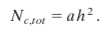
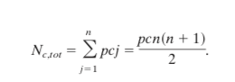

- 論文URL(https://www.pnas.org/content/102/46/16569)

## 論文執筆者の影響力を図った論文

### 先行研究での影響力の基準
1. 論文投稿数
2. 論文が引用された回数
3. 一つの論文に対する引用された回数
4. 引用回数が多いもの(例:50回以上)飲みを抜粋した論文数
5. 最も引用された論文q個を選んで(例 q=5)その論文それぞれの引用数をはかる

数字が上がるほど探索が難しくなるが，尺度としては良くなる．

### この論文ではh-indexという指標を採用
発表した論文のN個のうち，h個の論文がh回以上引用されていた場合，h-index(h指数)を獲得する
aは比例定数

論文の総数や引用数が異なった人を比較可能

### 次年度の論文数の推測

p:１年毎に研究者が発表した論文数
c: 翌年からの１年毎の論文の引用数
n: year

### 問題点
論文を書くのをやめたり，研究者の年齢によってh-indexは左右される．

