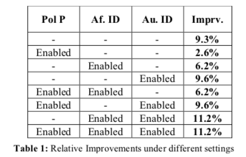

- 論文URL(http://www.aclweb.org/anthology/W16-0420)
- 著者のランキングを基に引用の極性を分類しており(p-index)，ベースラインのh-indexよりスコアを上げている
- ちなみにpolarity ID，affiliation ID, author ID の組み合わせでスコアをそれぞれ出している

- h-indexではなく(his/her index)ではなく，p-indexを使用している𝑝_𝑖𝑛𝑑𝑒𝑥(𝑓) = h_𝑖𝑛𝑑𝑒𝑥(𝑓) ∙ 𝑝^α ∙ 𝑛^β

- h-index(H-指標)
>>>h指数（エイチしすう、h-Index）とは、物理学者ジョージ・E・ハーシュが引用索引データベースWeb of ScienceのTimes Cited（被引用数）を元に考案した指標で、論文数と被引用数とに基づいて、科学者の研究に対する相対的な貢献度を示すものである。ただし引用に関する慣習は研究分野により異なるため、h指数は同じ研究分野における研究者同士の比較にのみ使用されるべき量である
h指数の定義と利点
ある研究者のh指数は、「その研究者が公刊した論文のうち、被引用数がh以上であるものがh以上あることを満たすような最大の数値」となる。具体的には、h指数が30である研究者は、被引用数30以上の論文が少なくとも30編あるが、被引用数31以上の論文は31編未満であることを示す。この指標は、当該研究者の論文の量（論文数）と論文の質（被引用数）とを同時に１つの数値で表すことができるという利点を持つ。

h指数の計算例　(カッコ内は被引用数)
論文A(10), 論文B(8), 論文C(5), 論文D(4), 論文E(3) →h指数=4
論文A(25), 論文B(8), 論文C(5), 論文D(3), 論文E(3) →h指数=3
https://ja.wikipedia.org/wiki/H%E6%8C%87%E6%95%B0

他に有名所ではg-index(Egghe, 2006)がある
https://en.wikipedia.org/wiki/G-index
