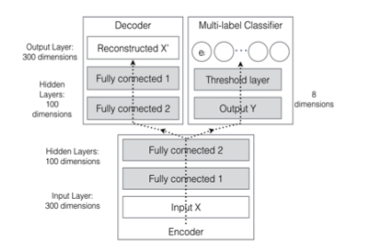

# Autoencoder for Semisupervised Multiple Emotion Detection of Conversation Transcripts
## Duc-Anh Phan, Yuji Matsumoto, Hiroyuki Shindo

### 要約
テキスト対話において２つ以上の感情を検出するタスクをオートエンコーダーを使ってといた論文

### コーパス
- IMDb(映画の対話データセット)のうち1000対話を２つ以上の感情でアノテートした。
- 感情の定義はPlutchikのものを使用。詳細(https://swingroot.com/plutchik-emotion/)

### メソッド
- word2vec 96次元

- emotion features

感情ベクトルを与え、強度によってベクトルの値を変えた。例:喜び[1,0,0,0] エクスタシー[1.5,0,0,0], 悲しみ[-1,0,0,0]
- Text2vec 300dim

発話のため文脈情報を捉える必要がある
whole conversation(100dim) + Previous utterance(100dim) + Current utterance(100dim) 

- 半教師つきオートエンコーダー

いわゆるよくあるオートエンコーダ

### 評価方法
- hamming score
- F1(precisionもrecallも大事なので)

### 新規性
本来感情というものは一つで表せられるものではないが、タスクの単純化のため先行研究では１つの感情を検出するものが多い。
この論文では２つ以上の感情をアノテートされたデータセット(EMTC)を使用し、検出した。

### 論文誌
IEEE TRANSACTIONS ON AFFECTIVE COMPUTING
